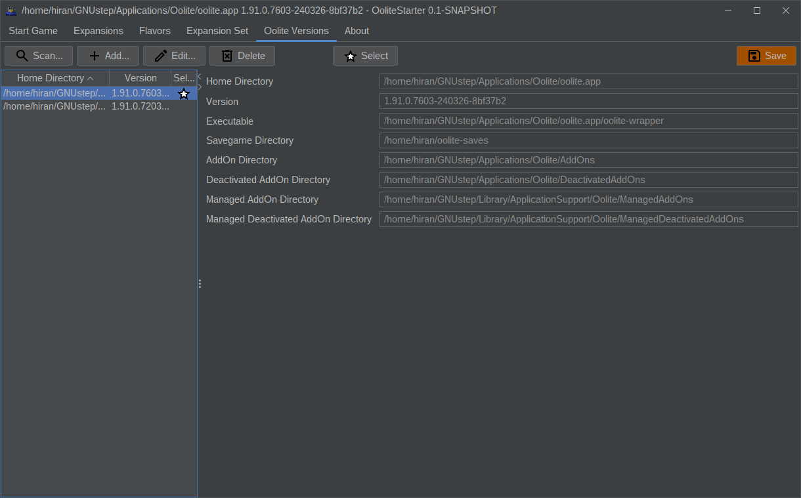

# Oolite Starter 

The Oolite Starter allows users to more comfortably preconfigure Oolite
for various missions. It's main purpose is to ease OXP management, Oolite versions
and manage save games.

So obviously it allows you to install and remove OXPs. It shows conflicts and
dependencies so you can avoid problems as early as possible. If you ever tried
to remember which list of OXPs you had installed, OoliteStarter allows to save
and reconstruct them. You can also share the list of OXPs with others if you like.

Also OoliteStarter remembers which OXPs were in use when you saved the game, and
you can restore that state with just the click of a button.

While you create savegames in Oolite, OoliteStarter allows to browse the savegames
and choose which one to launch. But you can also delete no longer needed files.

There are more goodies like auto update checks for OoliteStarter, OXPs and
Oolite itself. Or MQTT functionality that allow adding more cockpit gauges or
input controls to be connected to Oolite.

## Requirements (generic package only)

* Be aware this is a manual install. If you feel unsure what to do you are likely
  better off with the installer packages.
* You need to have Java SDK 21 or newer installed. 
  If you are unfamiliar with installing Java on Linux, follow
  https://www.youtube.com/watch?v=7lzIP-PvHoY
  If you are unfamiliar with installing Java on MacOS, follow
  https://www.youtube.com/watch?v=wXotUgqOdh8
  If you are unfamiliar with installing Java on Windows, follow
  https://www.youtube.com/watch?v=IJ-PJbvJBGs
* You need to have a copy of the generic Oolite Starter unzipped in a directory of
  your choice. Just in case, you can download it from
  https://github.com/OoliteProject/OoliteStarter/releases

## Installation and Uninstallation

### Generic Package

Be aware this is a manual install. If you feel unsure what to do you are likely
better off with the installer packages.

Download the .tar.gz or the .zip file and extract in a directory of your choice.
You might want to create a shortcut to run.sh or run.cmd.

To remove the software, just delete the directory you have created and the 
shortcut in case you created it.

If, directly at startup, you see error messages like
java.lang.UnsupportedClassVersionError: oolite/starter/MainFrame has been compiled by a more recent version of the Java Runtime (class file version 61.0), this version of the Java Runtime only recognizes class file versions up to...
you are running a too old JVM. Not only check whether Java 21+ is installed, also
make sure it is used (there may be multiple Java installations on your system).

### Linux (.deb)

Download the .deb file. Run

    sudo apt install <path to downloaded .deb>

After that you should see a new icon in your desktop environment.

To remove the software, run

    sudo apt remove oolitestarter

### MacOS (.pkg)

Download the .pkg file, then Ctrl-click it to run the installer.
After installation you should see a new icon in your desktop environment.

### Windows (.exe)

Download the .exe file. Tell Windows you want to keep the file regardless of
warnings. Then run the installer. It will automatically install OoliteStarter
and create menu and desktop shortcuts.

To remove the software, go to control panel/apps. Search for OoliteStarter
and choose to uninstall.

## Configuration (Installations)

When you run the application, it will seach the configuration file
$HOME/.oolite-starter.conf

If this file is not present, do not worry. A warning will be displayed and 
OoliteStarter will run. Switch to the `Oolite Versions` tab and add at least one
Oolite installation (there are Add and Scan options). Then press Save and the 
missing file will be created.

For each Oolite installation you can define a number of places in the filesystem.
Since some players have multiple such installations in parallel, they can be
configured in parallel which allows fast switching.

Oolite-Starter needs to know which Oolite installation it should actually use.
This is especially important if you have multiple installed. Select the one of 
your choice and press the Activate button. At this time OoliteStarter
will check if some directory is missing and also offers to create it for you.
Then it scans the directories for expansions and allows you to switch the tabs.

## Usage (Quickstart)

* Run Oolite Starter. Depending on your operating system and the package you 
  chose this may mean to just click an icon, a menu entry or use either 
  run.sh or run.cmd. When going for run.sh you may need to set execute
  permissions (chmod +x run.sh)
* Once a week there will be an update check, searching for
  * new versions of OoliteStarter
  * new versions of Oolite
  * new versions of installed expansions
  You will get informed if newer stuff is found.
* The Starter will present you with the list of your save games. Either press
  the 'New' button to run a new game, or choose the save game and press 'Resume'.
  Either of those buttons will run Oolite the way you chose.
* Play as usual.
* If you want to change the installed expansions, switch to the 'Expansions' tab,
  check the list and choose to install, remove, enable or disable single expansions.
  You can also export your currently active expansions as 'Oolite Expansion Set',
  and load it later again or share with your friends. Or go for a predefined
  set of expansions called Flavor.

Happy Flying!

## Usage (Detailed description)

In the following you will find detailed description of each of these use cases:

### SaveGames

Here is what you can do:

This is what it looks like:

What you see here is a panel showing the list of your save games. You can sort
the list by clicking the column headers. One of the savegames is selected. The 
right hand side provides more information about the selected one. The box in the
lower right lists all expansions that were in use when the game was saved. Now
it is marked with color as there are some discrepancies between the required and
the installed expansions.

In case OoliteStarter triggered Oolite and is waiting for the process to finish
it looks like this (usually OoliteStarter tries not to be in your way and 
automatically minimizes itself. If you need it back just click the window to
bring it back):

OoliteStarter tries to let you know some details what it is waiting for. If you
believe this is wrong check the logfiles. Or file a bug.

#### New

Starts Oolite the usual way. You can use it to start a new commander.

#### Resume

Starts Oolite with the selected savegame. The game will be loaded from disk so
you can continue that game. Requires that you saved the game before from
within Oolite.

If discrepancies are detected you get a warning message.

#### Delete

Deletes the selected savegame.

#### Fix

The Fix button allows OoliteStarter to recreate the expansions required for the 
savegame.

#### Reload

Loads data freshly from disk. This is similar to pressing reload in your web 
browser. OoliteStarter reloads the data automatically when a change is likely to
have happened. If you still feel the data might be outdated just click here.

### Expansion Management

Here is what you can do:

This is what it looks like:

You can see two lists of expansions: Those available for installation on the
left, and those already installed on the right.

One of the expansions is selected, and in the bottom you see additional
information about the selection. The buttons in the middle allow to Install,
Download, Remove and Delete.

You can sort and filter the list of expansions by clicking the button on the
top right of the lists.

The color codes in the expansion lists mark up conflicts or missing dependencies
(red), or a recommendation (yellow). In either case the details field in the
bottom will deliver more information.

Expansions follow this lifecycle. It should explain why in Oolite Versions 
Management so many directories need to be configured.

OXZs that are listed on the Expansion Manager's manifest can have a full
lifecycle through install and remove. Other expansions can be installed by
giving a Download URL, will be stored in the Addons folder and will get deleted
afterwards.

#### Install

Installs an OXZ from the Expansion Manager's manifest into the ManagedAddons
folder.

#### Download

Downloads a zipped OXP from a given URL and expands it into the Addons folder.

#### Remove

Deletes the selected OXZ from the ManagedAddons folder. It returns to the list
of available addons.

#### Delete

Deletes the selected OXP from the Addons folder.

#### Activate

Not available in the current version.

#### Deactivate

Not available in the current version.

### Flavors

Flavors are predefined sets of expansions. You can install a flavor in
addition to the expansions you have already installed. Or you can install it as a 
replacement, which means OoliteStarter will remove all expansions that are
not part of the flavor.

Either way, OoliteStarter will automatically compute which
expansions need to be removed or installed and show a list for your approval
before getting active.

### Expansion Set

You can save your set of currently installed expansions into a file.
Keep it somewhere, or share it with others. When loading such a file, 
OoliteStarter will automatically compute which expansions need to be removed or 
installed and show a list for your approval.

### Oolite Versions

Here is what you can do:

This is what it looks like:

On the left side you can see all configured Oolite versions. You can sort the
list by clicking the column headers. One of the versions is selected. The right
side reveals more details about the version.

On the top you see the actions that you can trigger and that are described in 
the following.

#### Add

Brings up a configuration dialog that allows you entering all the relevant
directory paths for Oolite. Once you press Ok you can see the new version
to be added to the list of versions.

When browsing the filesystem to search for the correct file or folder, note
that some files are displayed with an Oolite icon.

The icon shall indicate that the file or folder is relevant to OoliteStarter,
and in the right area it tries to explain why. This shall help find the correct 
entries.

Hint: Put special effort on finding the Oolite home directory. OoliteStarter
will try to autodetect the other values as much as possible.

#### Scan

In case you want OoliteStarter to search for Oolite on your behalf just click
this button. 

While the search is running you can already accept one of the 
Oolite home directories found so far. As soon as you click Ok the system
switches to Add mode allowing you to tweak the settings before they are added
to the list of versions.

#### Remove

Removes the selected version from the list.

#### Edit

Allows you to change settings in the selected version.

#### Activate

Since you can have multiple versions configured, OoliteStarter needs to know
which of the settings to work with. The Select button will activate the selected
version. Only one version can be active at any time. It is marked with a star.

#### Save

All the version settings are just held in RAM and lost when you exit 
OoliteStarter. Press Save if you want these settings to be available when you
next time run OoliteStarter.

The configuration data is stored in $HOME/.oolite-starter.conf.

## MQTT Configuration

OoliteStarter can push Oolite into the world of IoT. Events from the game get
published via MQTT. Feel free to connect any amount and type of MQTT clients to
react to the published messages.

The current implementation will send messages as specified in
https://github.com/maikschulz/oolite-mqtt-bridge
which means the same NodeRed client setup can be used to visualize the data.

There are prerequisites that must be met for such messages to be published:
- You need to have an Oolite version that contains the DebugOXP (that is either
a test or development version)
- OoliteStarter must have detected the DebugOXP (a checkmark in the installation
settings)
- You must have configured MQTT broker details. This currently requires editing
the $HOME/.oolite-starter.conf file manually.

Add a section like this into your configuration file, then start up OoliteStarter:

    <?xml version="1.0" encoding="UTF-8" standalone="no"?>
    <OoliteStarter>
        ...
        <Installation ...>
            ...
            <Mqtt>
                <BrokerUrl>tcp://192.168.178.51:1883</BrokerUrl>
                <User>artemis</User>
                <Password>artemis</Password>
                <Prefix>prefix</Prefix>
            </Mqtt>
        </Installation>
    </OoliteStarter>

These events will be happening:

If OoliteStarter cannot grab the TCP Port it will not complain. But at the same
time it will not be able to receive events to be forwarded to MQTT.

To debug you can use e.g. Mosquitto as broker and the command line client to show
incoming messages. Run something like this command:

    mosquitto_sub -h 192.168.178.51 -p 1883 -t "#" -v -u <user> -P <password>

### Feedback Channel

OoliteStarter not only allows Oolite to publish messages to MQTT. It also allows
MQTT devices to respond and feeds these messages back into Oolite. All a client
has to do is to publish a JSON message on the oolite/input topic that looks like
this:

    { 'command': "somestring" }

While this may look like overhead it allows future extension of the messages.

Make sure 'somestring' is a valid Oolite command - or expect some Oolite complaints
and ranting in one of the other topics.

As a test you can run e.g. Mosquitto client like this:

    mosquitto_pub -h 192.168.178.51 -p 1883 -t "oolite/input" -u <user> -P <password> -m "{'command': 'somestring'}"

### OoliteStarter and Oolite Debug Console

As only one application can listen for connections on the TCP port 1883, you have
to choose which one gets the port. As long as you start the Oolite Debug Console
prior to launching the Oolite session you are good to go.

## Tuning

You can modify OoliteStarter's appearance as much as FlatLAF allows. This is done
by setting the right system properties as can be seen in
https://www.formdev.com/flatlaf/system-properties/

Now OoliteStarter is packaged using JPackage which automatically wraps Java 
applications into an easy to distribute executable. So there is no command line
to set system properties on. Instead there is a configuration file.

This configuration file resides in either one of

    $OOLITESTARTER_HOME/app/OoliteStarter.cfg
    $OOLITESTARTER_HOME/lib/app/OoliteStarter.cfg.

On Linux this defaults to 

    /opt/oolitestarter/lib/app/OoliteStarter.cfg

on Windows search for 

    C:\Program Files\OoliteStarter\app\OoliteStarter.cfg

Once you found the file, inside you will see a section called JavaOptions.
You can add more system properties, each one as a new line like so:

    [JavaOptions]
    java-options=-Djpackage.app-version=0.1-29
    java-options=-Dflatlaf.uiScale=2.5

The example shows how to scale the fonts used in case you have a high resolution
screen.